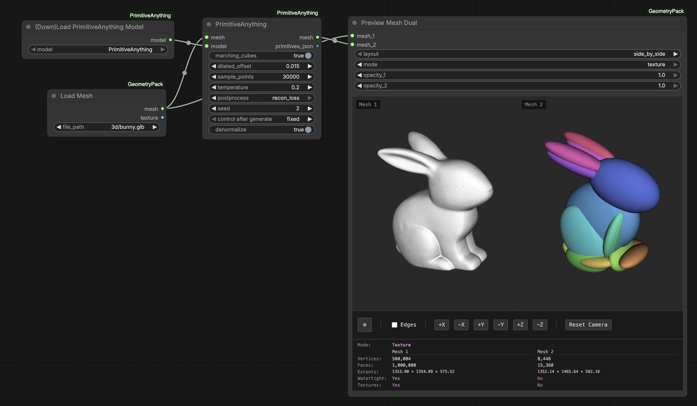

# ComfyUI-PrimitiveAnything

ComfyUI wrapper for [PrimitiveAnything](https://github.com/hyz317/PrimitiveAnything) - decompose 3D meshes into primitive assemblies (cubes, spheres, cylinders) using an auto-regressive transformer.



https://github.com/user-attachments/assets/d832916f-3ab4-4750-8f35-16152158c235


## Installation

Install via ComfyUI-Manager or clone to `custom_nodes/`:
```bash
cd ComfyUI/custom_nodes
git clone https://github.com/PozzettiAndrea/ComfyUI-PrimitiveAnything
pip install -r ComfyUI-PrimitiveAnything/requirements.txt
```

pytorch3d is installed automatically on first run via `install.py`.

## Nodes

- **PrimitiveAnything** - Main node for primitive decomposition

## Usage

1. Load a 3D mesh (GLB/OBJ/STL)
2. Connect to PrimitiveAnything node
3. Model downloads automatically from HuggingFace on first run
4. Output: GLB with colored primitives (15 HLS colors)

## Community

Questions or feature requests? Open a [Discussion](https://github.com/PozzettiAndrea/ComfyUI-PrimitiveAnything/discussions) on GitHub.

Join the [Comfy3D Discord](https://discord.gg/PN743tE5) for help, updates, and chat about 3D workflows in ComfyUI.

## License

MIT
